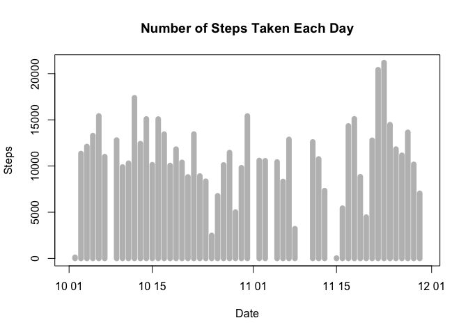
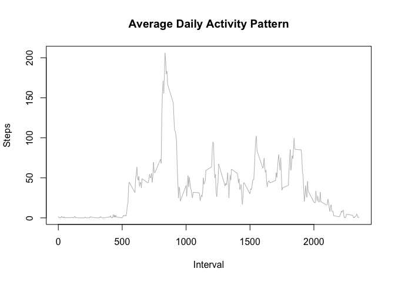
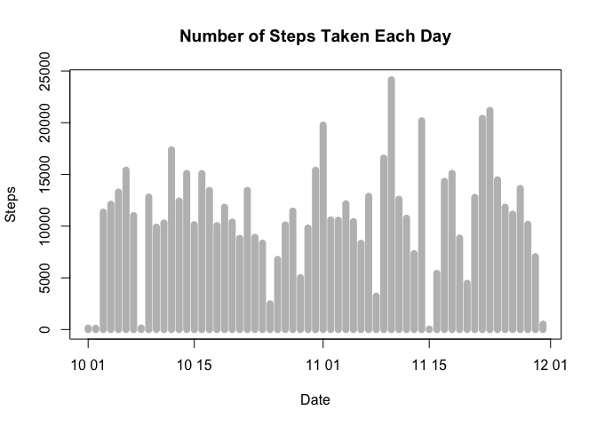
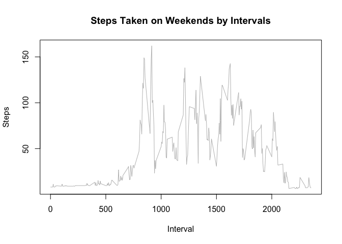
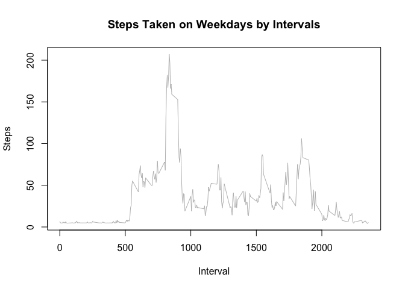

# Reproducible Research: Peer Assessment 1


## 1. Loading and preprocessing the data

```r
## Unzips 'activity.zip' if 'activity.csv' is not found
if (!file.exists("activity.csv")) {
  unzip("activity.zip")
}

## Loads 'activity.csv'
activity <- read.csv("activity.csv")

## Converts date characters into Date class
activity$date <- as.Date(activity$date)
```


## 2. What is mean total number of steps taken per day?

```r
## Loads require library
library(reshape2)

## Reshapes the data appropriate for processing
mActivityDate <- melt(data=activity, id.vars="date", measure.vars="steps", na.rm=FALSE)
sumDailySteps <- dcast(data=mActivityDate, date ~ variable, sum)

## Plots the histogram of the sum of daily steps
plot(sumDailySteps$date, sumDailySteps$steps, type="h", main="Number of Steps Taken Each Day", xlab="Date", ylab="Steps", lwd=8, col="grey")
```

\

```r
## Calculates and prints the mean and median of total steps taken per day from the dataset
meanSteps <- mean(sumDailySteps$steps, na.rm=TRUE)
medianSteps <- median(sumDailySteps$steps, na.rm=TRUE)
paste("Mean: ", meanSteps)
```

```
## [1] "Mean:  10766.1886792453"
```

```r
paste("Median: ", medianSteps)
```

```
## [1] "Median:  10765"
```


## 3. What is the average daily activity pattern?

```r
## Reshapes the data appropriate for processing
mActivityInterval <- melt(data=activity, id.vars="interval", measure.vars="steps", na.rm=TRUE)
meanStepsByInterval <- dcast(data=mActivityInterval, interval ~ variable, mean)

## Plots the average daily activity pattern
plot(meanStepsByInterval$interval, meanStepsByInterval$steps, type="l", main="Average Daily Activity Pattern", xlab="Interval", ylab="Steps", col="grey")
```

\

```r
## Finds and prints the interval where the mean daily steps is maximum
index <- which(meanStepsByInterval$steps == max(meanStepsByInterval$steps))
paste("Interval w/ Maximum Number of Steps: ", meanStepsByInterval$interval[index], " with ", max(meanStepsByInterval$steps))
```

```
## [1] "Interval w/ Maximum Number of Steps:  835  with  206.169811320755"
```


## 4. Imputing missing values

```r
## Gets the total count of NAs in the observation of 'steps' in 'activity'
sum(is.na(activity$steps))
```

```
## [1] 2304
```

```r
## Replace NAs in 'activity' with the mean of each interval
activityNew <- activity
activityMerge <- merge(activityNew, meanStepsByInterval, by="interval", suffixes=c(".orgn", ".mean"))
naIndex <- which(is.na(activityNew$steps))
activityNew[naIndex, "steps"] <- activityMerge[naIndex, "steps.mean"]

## Reshapes the data approriate for processing
mActivityDateNew <- melt(activityNew, id.vars="date", measure.vars="steps")
sumDailyStepsNew <- dcast(mActivityDateNew, date ~ variable, sum)

## Plots the histogram of the sum of daily steps with NAs replaced
plot(sumDailyStepsNew$date, sumDailyStepsNew$steps, type="h", main="Number of Steps Taken Each Day", xlab="Date", ylab="Steps", lwd=8, col="grey")
```

\

```r
## Calculates and prints the mean and median of the new data
meanStepsNew <- mean(sumDailyStepsNew$steps)
medianStepsNew <- median(sumDailyStepsNew$steps)
paste("New Mean: ", meanStepsNew)
```

```
## [1] "New Mean:  10889.7992576554"
```

```r
paste("New Median: ", medianStepsNew)
```

```
## [1] "New Median:  11015"
```


## 5. Are there differences in activity patterns between weekdays and weekends?

```r
## Sets locale to en-GB
Sys.setlocale("LC_ALL", 'en_GB.UTF-8')
```

```
## [1] "en_GB.UTF-8/en_GB.UTF-8/en_GB.UTF-8/C/en_GB.UTF-8/ko_KR.UTF-8"
```

```r
## Defines a function to determine whether the given date is a weekday or a weekend
determineDay <- function(date) {
  res <- NA
  if (weekdays(date) == "Sunday" | weekdays(date) == "Saturday")
    res <- "weekend"
  else
    res <- "weekday"
  return(res)
}

## Converts the date strings into a list
dateList <- as.list(activityNew$date)

## Applies the list against 'determineDay' to determine the day of week
typeResult <- lapply(dateList, determineDay)
activityNew$dayType <- typeResult

## Subsets the day according to "weekend"" vs "weekday"
activityWeekend <- subset(activityNew, dayType == "weekend")
activityWeekday <- subset(activityNew, dayType == "weekday")

## Reshapes the data appropriate for processing
meltWeekend <- melt(activityWeekend, id.vars="interval", measure.vars="steps")
meltWeekday <- melt(activityWeekday, id.vars="interval", measure.vars="steps")
stepsWeekendByInterval <- dcast(meltWeekend, interval ~ variable, mean)
stepsWeekdayByInterval <- dcast(meltWeekday, interval ~ variable, mean)

## Plots graph for steps on weekends vs weekdays
plot(stepsWeekendByInterval$interval, stepsWeekendByInterval$steps, type="l", main="Steps Taken on Weekends by Intervals", xlab="Interval", ylab="Steps", col="grey")
```

\

```r
plot(stepsWeekdayByInterval$interval, stepsWeekdayByInterval$steps, type="l", main="Steps Taken on Weekdays by Intervals", xlab="Interval", ylab="Steps", col="grey")
```

\
